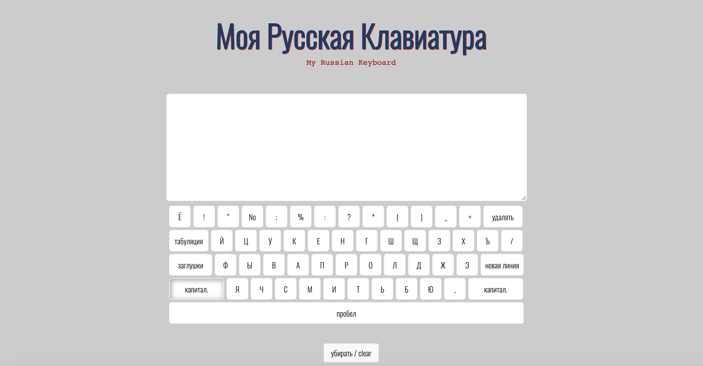

# Русская Клавиатура

#### Russian Keyboard
Learning Russian? This app is designed to help russian learners practice their typing to aid their studies. удачи!
- Inspired from [ florinpop17/app-ideas/ ..Typing Practice](https://github.com/florinpop17/app-ideas/blob/master/Projects/2-Intermediate/Typing-Practice-App.md)

## Dependencies
-  [GAs Browser Template](https://git.generalassemb.ly/ga-wdi-boston/browser-template)
  - Webpack, Bootstrap, and Handlebars included
- `npm install`

## User Stories
### MVP
As a user I want to...
* see an russian keyboard interface
* see my keystrokes reflected on the keyboard interface and screen
* have my spacing keys behave approriately

## Moderate Stretch Goals
* see a representataion of successful, erred and total attempts in a score box
* see a dynamic representation of my typing speed score as I practice
* see prompt word(s) in a text box that represents my keystrokes as I type
* click a 'Start Practice' button to start the practice session.
* be able to stop the practice session (by button click or time out)

### Adv. Stretch Goals
* add audible tone when new word is displayed, correctly entered, or an error was made
* User can see cumulative performance statistics across all of his/her practice sessions.
